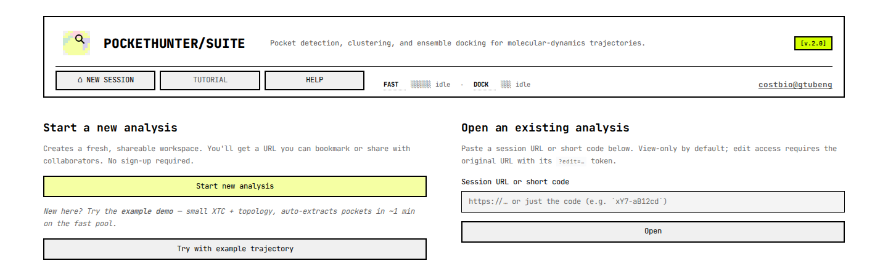
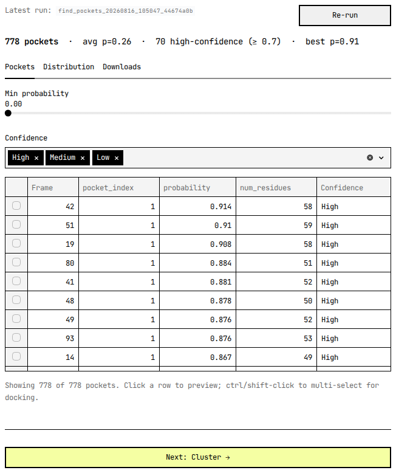
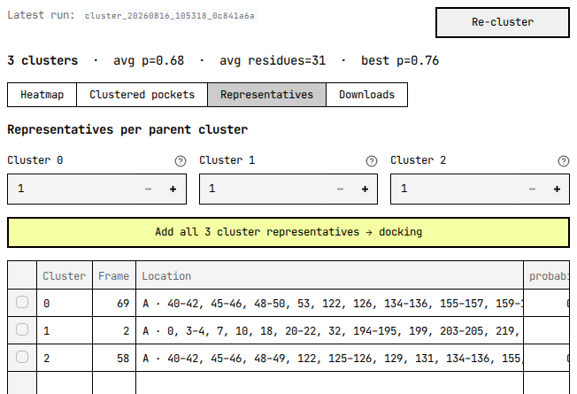
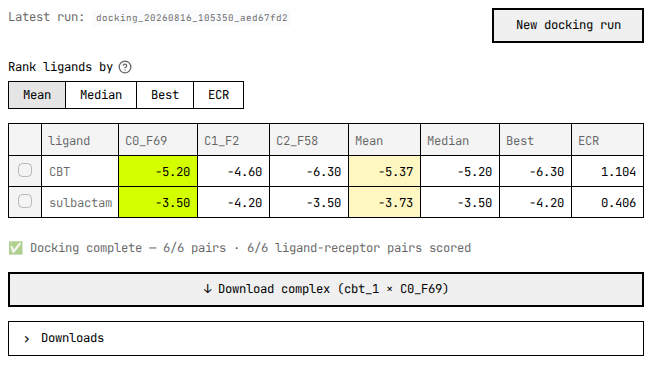

# PocketHunter Suite tutorial

## Welcome

Find transient, druggable pockets across a molecular-dynamics trajectory —
then dock ligands against them.

A pocket that's wide open in one frame can be shut in the next. Run pocket
detection on a single crystal structure and you see one snapshot of that
motion — the cryptic site that opens for a handful of frames simply isn't
there. This service takes the trajectory instead. It extracts every tenth
frame by default, runs p2rank on each extracted structure, groups the hits
that share the same lining residues into clusters, and docks your ligands
into the cluster representatives with SMINA. What you hand it is an `.xtc`
and a topology — or, if you already hold the frames as structures, a ZIP
of PDBs; what you get back is a ranked pocket list with the frames each
pocket appeared in, plus binding scores for the ligands you tried.

<svg class="schematic" viewBox="0 0 620 120" role="img"
     aria-label="Pipeline: upload, find pockets, cluster, dock">
  <a class="stage" href="#upload">
    <rect x="10" y="24" width="130" height="72"/>
    <text class="stage-title" x="24" y="50">UPLOAD</text>
    <text x="24" y="68">topology.pdb</text>
    <text x="24" y="84">trajectory.xtc</text>
  </a>
  <path class="arrow" d="M148 60 h20 m-6 -5 l6 5 l-6 5"/>
  <a class="stage" href="#find-pockets">
    <rect x="175" y="24" width="130" height="72"/>
    <text class="stage-title" x="189" y="50">FIND POCKETS</text>
    <text x="189" y="68">p2rank, per frame</text>
  </a>
  <path class="arrow" d="M313 60 h20 m-6 -5 l6 5 l-6 5"/>
  <a class="stage" href="#cluster">
    <rect x="340" y="24" width="130" height="72"/>
    <text class="stage-title" x="354" y="50">CLUSTER</text>
    <text x="354" y="68">group by residues</text>
  </a>
  <path class="arrow" d="M478 60 h20 m-6 -5 l6 5 l-6 5"/>
  <a class="stage" href="#dock">
    <rect x="505" y="24" width="105" height="72"/>
    <text class="stage-title" x="519" y="50">DOCK</text>
    <text x="519" y="68">SMINA</text>
  </a>
</svg>

Each stage above links to its section.

FOR YOU IF

- You have an MD trajectory — or any other ensemble of conformations — and want the pockets a single static structure would miss.
- You want those pockets ranked and grouped rather than one hit per frame.
- You want to dock ligands against the pockets you select.

NOT FOR YOU IF

- You have one static structure — run p2rank directly instead.
- You need covalent docking, or docking into a membrane or nucleic-acid site.
- You need a guaranteed turnaround; this is a shared, quota-limited service.

<dl class="facts">
  <dt>Worked example</dt>
  <dd>The bundled TEM-1 β-lactamase ensemble — 98 conformations of a
  single 263-residue chain, all 98 searched, because the example button
  runs at stride 1 rather than the panel's default of 10</dd>
  <dt>Time to first pockets</dt>
  <dd>20 seconds, end to end, on an otherwise-idle fast pool — measured
  2026-08-16 from job
  <code>find_pockets_20260816_105047_44674a0b</code>'s own submission
  timestamp to its completion update, 10:50:47.7 to 10:51:08.0. A
  busier pool will be slower; the
  "~1 min" the landing page quotes in the italic line between its two
  buttons (screenshot below) is a conservative headline figure for that
  reason, not a different measurement.</dd>
  <dt>You end up with</dt>
  <dd>Ranked pockets per frame · cluster representatives · SMINA scores · downloadable poses</dd>
</dl>

## Upload your files {: #upload }

The Find pockets panel opens with an **Input source** radio button. Pick
*From trajectory (XTC + topology)* and two uploaders appear: **Trajectory
(.xtc)** takes a GROMACS `.xtc` and nothing else, while **Topology (.pdb,
.gro)** takes either extension, so a `.gro` reference structure works just
as well as a PDB. Under them sits **Frame stride**, an integer of at least
1 that starts at 10 — raise it for a long trajectory, drop it to 1 to
search every frame. Pick *From PDB ZIP archive* instead and you get a
single **PDB structures (.zip)** uploader; extraction is skipped and
p2rank runs straight over the structures in the archive.

Two size limits apply, and the tighter one is the browser's. Streamlit's
uploader refuses a file over 200 MB before it ever reaches the server, so
200 MB per file is the number that actually binds; the server-side
validator behind it is set to 500 MB (`MAX_UPLOAD_SIZE=524288000`). A ZIP
clears two further checks before anything is unpacked: its compression
ratio has to stay at or below 100:1, and its contents have to come to less
than 1 GB uncompressed (`MAX_ZIP_SIZE=1073741824`). The extension
allowlist is short — `.xtc`, `.pdb`, `.gro`, `.csv`, `.zip`, `.sdf`,
`.pdbqt` — and anything else is rejected on its name before it lands on
disk.

No trajectory to hand? The landing page carries a **Try with example
trajectory** button beside **Start new analysis**. It copies a bundled
TEM-1 β-lactamase demo into a fresh session and queues the pocket search
without asking you for anything: `examples/tem1/topology.pdb` is 104,845
bytes and `examples/tem1/trajectory.xtc` is 500,352 bytes. The deployed
instance reads that pair from `/app/examples/tem1`, set as
`EXAMPLE_TRAJECTORY_DIR`; when the directory is missing the button hides
itself rather than failing on you. That one job is submitted at stride 1,
not at the 10 the panel offers you — the ensemble is short enough that
searching every member costs about as much as searching a tenth of it,
and a first run is more informative when nothing has been skipped.

**What the example actually contains, because it governs how to read
every number that follows.** It is not a molecular-dynamics trajectory.
It is a 98-member conformational ensemble of TEM-1 β-lactamase produced
by a generative model from the 1BTL crystal structure, then written to
XTC so it travels the same code path a real trajectory would. Two things
follow from that. The members are independent draws, so their order
carries no time and no kinetics — member 40 does not come after member 39
in any physical sense, and no sequence of them is a transition. And the
model lays down one rigid frame per residue, from which N, CA, C, O and
CB are reconstructed geometrically; nothing past CB was ever generated.
Load the pair in any viewer and you will count 1,294 atoms across 263
residues, with exactly those five atom names and no others.

That is enough for the first two stages and not enough for the third.
p2rank scores a surface, and the site this example is interesting for —
TEM-1 has a well-described cryptic pocket that opens when helices 11 and
12 draw apart — is opened by backbone motion, which is present here.
Docking is where the missing side chains bite: a ligand has far less to
pack against than it would in an all-atom structure. Read the worked
example's affinities as evidence that the pipeline runs end to end, not
as a prediction about the molecules in it. Your own trajectories, if
they are all-atom, have no such caveat.

## Sessions {: #sessions }

There is no sign-up. Pressing **Start new analysis** mints a workspace and
lands you on `https://pockethunter.bio-cloud.site/?s=<code>&edit=<secret>`,
where `s` is an 11-character short code and `edit` is a 32-character
secret, both drawn from `secrets.token_urlsafe`. That URL is the only
credential the session has — nothing gets emailed to you, and a lost
`edit=` token can't be recovered. Bookmark it, then start a job before you
wander off; an unused session does not survive its first cleanup sweep.

Which half of the URL you're holding decides what you can do. With a
matching `edit=` token the masthead chip reads **✏️ Editor** and every
control works; with only `?s=` it reads **👁 Viewer**, and the uploaders
and the buttons that launch jobs all come up greyed out. A viewer still
gets the whole read side: the Mol\* structure, the pocket tables, the
cluster assignments, the docking scores. An editor also gets two copy
buttons beside the chip, labelled *view-only link* and *editor link*; a
viewer sees only the first, having no token to hand out. Send colleagues
the view-only link unless you mean for them to run jobs on your session.

What the session has done persists on the server. Job rows live in
Postgres and their artefacts under `results/<job_id>/`, so reopening the
URL next week brings the pocket tables and the poses back with nothing
recomputed. Your browser keeps its own list of the sessions you've
visited, in a cookie named `ph_recent_sessions` — that list is client-side
only and never reaches the server, so clearing cookies loses your session
links unless you saved them somewhere else.

**A bookmark is not storage.** A session that has never submitted a job is
deleted 15 minutes after it was *created* (`SESSION_GRACE_MINUTES=15`),
by a `cleanup-abandoned-sessions` task that runs every five minutes. That
task reads creation time, not last activity, so keeping the tab open buys
you nothing. Make a session, run something. Bookmark the URL, come back an
hour later having started nothing, and there is nothing to come back to.

Sessions that did run work live far longer, on two slower timers, both
UTC. Job directories untouched for 30 days go at 02:00 daily
(`CLEANUP_AFTER_DAYS=30`), uploads and results together. At 15 past every
hour a third task measures each session's disk usage and, for any session
over 5 GB (`PER_SESSION_DISK_QUOTA_MB=5000`), deletes its oldest jobs
until it fits again — the job rows survive, so the history still lists a
run whose files have gone.

## Find pockets

p2rank looks at one structure at a time, so the suite hands it every frame
in turn. Extraction runs first, with your stride applied; then `prank
predict` runs over a list of the extracted structures on four threads
(`P2RANK_THREADS=4`, not exposed in the UI); then the per-frame
prediction files are merged into
one `pockets.csv` with five columns — `File name`, `Frame`,
`pocket_index`, `probability`, `residues`. The table you see on screen
is not that file: the panel hides `File name` and `residues` and adds
two columns of its own, `num_residues` and `Confidence`, neither of
which is written to the CSV.

**A row is one pocket in one frame. It is not one site.** A groove that
stays open across forty frames produces forty rows, each with its own
`pocket_index` and its own slightly different residue list, and nothing
at this stage knows they describe the same place. The count in the stats
strip is therefore a count of detections, and it inflates fast: the
worked example's 98 conformations return about eight hits apiece, which
is the 778 in the screenshot below and nothing like 778 pockets. Turning
those rows back into sites is the next stage's entire job.

Take the `Frame` number for what it is, because **it is not an index into
your trajectory.** The label is the stride times the structure's 1-based
position among the extracted structures, so at stride 10 the structures
come out labelled 10, 20, 30 — while the conformations inside them are
your trajectory's frames 0, 10, 20. Every label sits one full stride
ahead of the frame it was cut from. The worked example runs at stride 1,
where the shift is exactly one: the `Frame 42` at the top of the
screenshot below is the ensemble's 42nd member, which is member 41 if you
count from zero as the file does. The labels agree with each other, so
comparing pockets between frames inside the app is unaffected; it is the
trip back to your own XTC that needs the correction. Subtract one stride
before you go looking at a conformation.

`probability` is p2rank's ligand-binding score for that pocket, and the
panel bins it into three badges — High from 0.7 up, Medium from 0.4, Low
below. The strip above the table gives the detection count, the mean
probability, how many rows cleared 0.7, and the single best score. Two
controls narrow the view: a **Min probability** slider running 0.0 to 1.0
in steps of 0.05 and starting at 0.0, and a **Confidence** multiselect
that starts with all three badges ticked. Both filter the table and
nothing else. No job re-runs, no row is deleted, and the caption
underneath keeps reporting how many of the total are on screen.

Click a row and the Mol\* viewer paints that pocket's residues and jumps
to the frame it was found in. That viewer is the 3D panel down the
left-hand column, and Reading the results covers it properly. A pocket
with fewer than three residues gets a warning instead of a surface —
below three points there is no mesh worth drawing. Ctrl- or shift-click
to take several rows at once and an
**Add N selected → docking** button appears under the table: pockets can
go straight from here into the docking selection without being clustered
at all, which is the right move when you already know which site you
care about.

The remaining two tabs are quieter. **Distribution** plots the
probability histogram and probability against residue count, the quickest
way to see whether a threshold you have in mind will keep everything or
nothing. **Downloads** offers `pockets.csv` and the subset at or above
0.7 on its own, plus a **Generate PDB archive** button that packs the
per-frame PDBs p2rank ran on into a ZIP you then download — the same
structures that become receptors when you dock.

Two outcomes get their own message rather than an empty table. Zero
pockets anywhere in the trajectory means detection finished and found
nothing, and the panel points at the stride and at a possible
topology/trajectory mismatch before anything else. More than 1,000
extracted frames (`MAX_TRAJECTORY_FRAMES=1000`) stops the job before
detection and names the stride to re-run with, because the viewer cannot
render a trajectory that long.

## Cluster

Clustering answers the question the pocket table cannot: which of those
per-frame detections are the same pocket? Pick a completed run from
**Source pockets**, and the stage reads its `pockets.csv`, drops every
row below **Min. ligand-binding probability** (slider 0.0–1.0 in 0.05
steps, starting at 0.5), and rewrites each surviving pocket as a binary
vector over the union of every pocket-lining residue seen anywhere in the
run — 1 where that residue lines this pocket, 0 where it does not.

**Those vectors hold no coordinates. Pockets are grouped by which
residues line them, not by where they sit.** DBSCAN runs with
`metric='hamming'`, so the distance between two pockets is the fraction
of residue slots on which they disagree. A pocket in frame 3 and a pocket
in frame 88 land together because the same residue identifiers line both,
whatever the geometry did in between. Read a cluster as a recurring
residue signature, not as a neighbourhood.

Each cluster's representative is its medoid — the member whose summed
Hamming distance to the rest of its cluster is smallest — written to
`cluster_representatives.csv`. Pockets DBSCAN cannot place go to label
`-1`, the noise bin, and are dropped from both the heatmap and the
representatives table.

**The `eps` and `min_samples` a run settles on are not optimal, and
nothing in the pipeline claims they are.** `PocketHunter/pockethunter.py`
sweeps `eps` from `1/num_residues` toward `10/num_residues` in 0.005
steps and `min_samples` upward from 2 % of the frame count (0.5 % above
100 frames), stopping short of 20 % of it, fits DBSCAN at every
combination with the Hamming metric, and keeps whichever fit scored
highest on `silhouette_score(df, labels)`. That scoring call sits in
`optimized_dbscan`, the same loop that does the fitting, and it uses
scikit-learn's default euclidean distance rather than the Hamming
distance that formed the groups, and it receives the noise rows as well,
scored as though `-1` were a cluster like any other. The winner is the
best fit under a ruler that is not the one that did the cutting. So treat
the output as a proposal and check it: open the Heatmap and confirm that
each block's residue signature really is distinct from its neighbours',
and if two clusters look like one pocket split in half, re-run at a
different `min_prob` rather than assuming the choice was made for you.

Results open on **Heatmap** — one strip per cluster, one row per pocket
labelled `p=… · F=…`, one column per residue, a filled cell meaning that
residue lines that pocket. Clicking a row pushes the pocket to the
left-hand Mol\* viewer and jumps to its frame. **Clustered pockets** is
the same information as a table. **Representatives** lists one row per
cluster and, where hierarchical refinement ran, a K spinner per
cluster: K=1 keeps the
DBSCAN medoid, K of 2 or more re-cuts that cluster's dendrogram into that
many sub-representatives, up to ten or the member count, whichever is
smaller. **Downloads** holds the CSVs.

**Add all N cluster representatives → docking**, above the Representatives
table, is the normal handoff to the next stage — one receptor per
displayed row, sub-cluster representatives grouped under their DBSCAN
parent.

The reduction is usually severe, and it is meant to be. Left at its
defaults the worked example takes the 778 detections of the previous
stage down to three clusters, drawn from frames 69, 2 and 58, averaging
31 lining residues and `probability` 0.68. Three receptors is a
comfortable docking run; 778 would not have been one.

When DBSCAN finds nothing the panel says so and names the two usual
causes: `min_prob` filtered out too much, or too few pockets survived to
form a dense group. Lowering the threshold and re-running Find pockets at
a smaller stride are the fixes. Switching **Method** to hierarchical will
always return clusters, which is occasionally what you want and never
evidence that the clusters mean anything.

## Dock

Docking needs two things: a set of pockets and a set of ligands. Pockets
arrive in a bucket that carries across stages, filled either from **Add
all N cluster representatives** or from rows you ticked in the pocket
table. Ligands come through one uploader taking `.pdbqt`, `.sdf`, `.pdb`
and `.zip`, several files at a time; SDF and PDB inputs are split
server-side into one PDBQT per molecule with OpenBabel. Leave **Generate
3D coordinates for ligands** off unless your input genuinely is 2D —
curated libraries already carry coordinates, and the option costs
minutes.

The **smina parameters** expander holds three controls. **Scoring
function** defaults to `vinardo`, with `vina`, `ad4_scoring` and
`dkoes_scoring` also on offer. **Number of poses** is smina's
`--num_modes`, 1 to 50, default 10 — how many binding modes are kept per
ligand-receptor pair. **pH (protonation)** runs 4.0 to 10.0 in 0.1 steps,
default 7.4, and is the pH OpenBabel protonates the receptor at before
writing it as PDBQT. Exhaustiveness is deliberately absent: it is pinned
server-side at `DOCKING_EXHAUSTIVENESS=8` with no slider, and the `.env`
comment beside it says as much.

You never draw a box. For each pocket the task takes the coordinates of
that pocket's lining residues, pads their bounding box by 2 Å on every
side, and clamps each edge into the range 10 Å to 25 Å — tight enough to
keep the search on the pocket, capped so that an over-large p2rank hit
cannot quietly become a whole-protein blind dock.

**Every cell in the score grid is a predicted binding affinity in
kcal/mol, and more negative is better** — −9.2 beats −6.4. The cell holds
the best pose of that one ligand against that one receptor: smina
generates up to **Number of poses** modes and the grid keeps the lowest
affinity among them. Rows are ligands, columns are the receptor
conformations you selected. That shape is the payoff for having run a
trajectory at all — one ligand scored against an ensemble of
conformations rather than against a single crystal structure.

Column headers read `C<cluster>_F<frame>`, so `C0_F69` is the
representative of cluster 0, taken from the structure labelled frame 69.
That is the same `Frame` label the pocket table used, one stride ahead of
your own numbering.

<figure markdown="1">

<figcaption>Both ligands were uploaded for this capture; neither ships
with the example. CBT is the compound Horn and Shoichet found bound to
TEM-1's cryptic pocket in PDB 1PZO, roughly 16 Å away from the active
site. Sulbactam is the orthosteric control — a clinical inhibitor of that
active site itself. The run reports "Docking complete — 6/6 pairs · 6/6
ligand-receptor pairs scored".</figcaption>

</figure>

**These particular numbers are a demonstration, not a result.** Their
receptors come from an ensemble with no side chains past CB, as the
example's own description warned, so every affinity here is computed
against less protein than really exists. CBT beating sulbactam on all
three receptors is a pleasing outcome and not evidence of anything; run
the same pair against all-atom conformations before drawing a conclusion.
What the figure is good for is the shape of the thing: two ligands, three
conformations, six numbers, four ways of collapsing a row.

That completion message carries two counters, and they count different
things. `6/6 pairs` is how many ligand-receptor jobs smina ran. `6/6
scored` is how many grid cells came back with a number in them. They part
company in two situations, and only one of the two is a failure. The
first is the ordinary one covered in Troubleshooting: a pair that ran and
produced no usable pose, which raises a warning above the grid and an
expander naming the pair. The second is quieter. If two of the pockets you picked were
found in the same frame, one frame is one PDB file, and the grid keys its
columns on the receptor file rather than on the pocket. Both pockets get
docked, each in its own box, but only one of the two columns picks its
result up; its twin sits empty with no warning and no failure log,
because as far as the run is concerned nothing failed. When a column
comes up empty on a run that reported no failures at all, that is the
case you are looking at — check the `Frame` labels of the pockets you
selected. The poses are all still in the full results CSV, filed under
the shared receptor filename, but nothing in there records which of the
two pockets any one of them came from.

Four columns on the right collapse each row to one number, and **Rank
ligands by** decides which of them sorts the grid. **Mean** and
**Median** each reduce that ligand's per-receptor affinities in kcal/mol
to a single figure — the arithmetic mean, and the middle value of the
sorted set — lowest first; reach for Median when one receptor in the
ensemble scores oddly. **Best** takes the single most-negative cell in
the row, which is the reading that surfaces a ligand fitting one rare
open conformation and nothing else. **ECR** is Exponential Consensus
Ranking: rank the ligands
separately on each receptor, then sum `exp(−rank/σ)` across receptors
with σ set to a tenth of the ligand count, floored at 1. It is unit-free
and higher is
better, and because it uses only ranks, a receptor whose scores are all
shifted cannot drag the consensus with it.

Click a row and the viewer loads that ligand's best pose in whichever
receptor the slider is on, with a download button for exactly that
complex — receptor PDB plus pose SDF. The Downloads expander carries the
rest: the full per-pose results CSV, a best-pose-per-pair CSV, a ZIP of
every pose SDF, and the receptors on their own.

Two gates apply before **Dock** will run. Molecules × pockets must come
to no more than 1,000 pairs (`DOCKING_MAX_PAIRS=1000`) — over that the
panel refuses the submission up front and tells you how many molecules
would fit — and a bucket holding more than 20 pockets (`MAX_DOCKING_PDBS`)
is trimmed to the 20 with the highest probability, with a warning shown
while you are still choosing.

One failure is worth naming here. If **every** receptor-ligand pair
fails, the task has nothing to write and stops with
`DockingProducedNoResults`, whose card is headed *Docking produced no
poses*. That is a docking failure and not an input rejection: smina ran
every pair and every one came back empty. The advice on the card names
the two usual causes, the ligand files and the box size, and a box too
small for smina to place anything inside is the more common of them.
When only some pairs fail you get a partial-results warning instead, and
the results you did get; that case is under Troubleshooting.

## Reading the results

The left-hand column holds one Mol\* viewer for the whole session, and
it does not reset when you switch stages. Whatever you clicked last
stays on screen: a pocket surface from the pocket table, a cluster
overpaint from the heatmap, a docked pose from the score grid. The
viewer does not poll on a timer either — it redraws when you move its
slider, when you click a row, or when a running job pushes a page
refresh. An idle tab left open overnight shows you exactly what it
showed at midnight.

**The number on the frame slider is a third numbering, and it agrees
with neither of the other two.** The label reads `Frame n / N`, where
`N` counts the models baked into the viewer file and `n` is your
position among them. Baking caps out at 200 models
(`MAX_VIEWER_LOADED_FRAMES=200`): extract 200 structures or fewer and
every one of them is in there, so slider position `n` is the `n`-th
extracted structure. Extract more and the viewer takes a second stride
of its own — `ceil(N_extracted / 200)`, so 2 for 400 structures, 5 for
the 1,000-structure ceiling — and the slider then steps over that
thinned set. Neither reading is the `Frame` column of `pockets.csv`,
and neither is a frame index in your XTC. Scrub to look around; click a
row when you need a specific pocket.

Clicking always wins over scrubbing, which is the point. A pocket row,
a cluster representative or a docking receptor carries the filename of
the structure it came from, so selecting it loads that exact structure
even when the viewer stride skipped it. You will know when that
happens: the slider disappears, a caption reads *Showing Frame X of Y —
single-frame mode*, and an **↩ Overview** button takes you back to the
scrub view. Under the viewer sits **↓ Download view (PDB)**, which
hands you the single frame currently rendered — the same button turns
into **↓ Download view (complex)** and ships a ZIP of receptor plus
pose whenever a docked ligand is on screen. On the Dock stage the
bottom slider stops walking frames altogether and walks receptors
instead, moving the grid's highlighted column with it.

Everything else leaves by a download button. Each one is built on
demand from what the job wrote to disk, so a session whose files were
pruned offers the CSVs it still has and quietly drops the rest.

| Download | Where | What is in it |
| --- | --- | --- |
| `pockets.csv` | Find pockets → Downloads | Every detection: `File name`, `Frame`, `pocket_index`, `probability`, `residues` |
| high-confidence subset | Find pockets → Downloads | The same columns, rows at `probability` ≥ 0.7 only |
| PDB archive (ZIP) | Find pockets → Downloads, after **Generate PDB archive** | Every per-frame PDB p2rank ran on |
| `cluster_representatives.csv` | Cluster → Downloads | One row per cluster medoid |
| high-quality subset | Cluster → Downloads | Representatives at `probability` ≥ 0.7 only |
| Cluster PDBs (ZIP) | Cluster → Downloads, or beside a selected row | Source-frame PDB of every member of the chosen cluster, plus a `metadata.csv` joining filenames to cluster, frame, probability and residues |
| Full results CSV | Dock → Downloads | Every pose of every ligand-receptor pair |
| Best-poses CSV | Dock → Downloads | One row per pair — the pose the grid cell shows |
| Download all results (ZIP) | Dock → Downloads | Per-pose SDFs plus both CSVs |
| Receptors only (ZIP) | Dock → Downloads | The receptor PDBs with no poses, plus a `metadata.csv`. The staging bucket has its own **↓ Download N receptors (ZIP)** for the same thing before you run |
| ↓ Download complex | Dock, beside a selected grid row | Receptor PDB, best-pose SDF, and a one-row `metadata.csv` carrying the affinity |

Archives are assembled in memory against a 512 MB budget
(`MAX_DOWNLOAD_ZIP_SIZE`), smallest file first. A ZIP that hits the
budget is still delivered; a caption below the button counts what was
left out. Take that as a signal to download per cluster rather than in
bulk.

## Parameter reference

Two kinds of control live in these panels and they behave very
differently. Settings-form parameters are read once, when you press the
stage button, and they define the job — changing one afterwards does
nothing until you run the stage again. Results-view parameters redraw
the table you are looking at and touch no job at all. The **Effect**
column below says which is which. Defaults are what the widget shows on
its first render; after that it remembers whatever you last set it to
for the rest of the browser session.

| Parameter | Where | Range | Default | Effect |
| --- | --- | --- | --- | --- |
| Input source | Find pockets, settings | From trajectory (XTC + topology) · From PDB ZIP archive | From trajectory | Trajectory mode extracts frames first; ZIP mode skips straight to p2rank |
| Frame stride | Find pockets, settings | Integer, 1 and up, no ceiling on the widget | 10 | Every n-th frame is extracted. Also sets the `Frame` labels, which come out at stride × extraction position |
| Min probability | Find pockets, results | 0.00 to 1.00, step 0.05 | 0.00 | View only — hides rows below the threshold |
| Confidence | Find pockets, results | High · Medium · Low, any combination | All three ticked | View only — hides badge classes |
| Source pockets | Cluster, settings | Completed pocket runs in this session, newest first | The newest one | Which `pockets.csv` gets clustered |
| Min. ligand-binding probability | Cluster, settings | 0.00 to 1.00, step 0.05 | 0.50 | Rows below it are dropped before the residue vectors are built, so it changes the clustering itself |
| Method | Cluster, settings | dbscan · hierarchical | dbscan | DBSCAN can return nothing; hierarchical always returns something |
| Hierarchical refinement | Cluster, settings, DBSCAN only | On · off | On | Sub-clusters within each DBSCAN cluster, which is what makes the K spinners appear later |
| K, per parent cluster | Cluster, Representatives tab | 1 up to the member count, capped at 10 | 1 | View only — 1 shows the DBSCAN medoid, higher re-cuts that cluster's dendrogram |
| Ligand files | Dock, settings | `.pdbqt` · `.sdf` · `.pdb` · `.zip`, several at once | — | SDF and PDB are split into one PDBQT per molecule |
| Generate 3D coordinates for ligands | Dock, settings | On · off | Off | Runs OpenBabel `--gen3d` during prep. Costs minutes; only 2D input needs it |
| Scoring function | Dock, smina parameters | vinardo · vina · ad4_scoring · dkoes_scoring | vinardo | smina's `--scoring` |
| Number of poses | Dock, smina parameters | 1 to 50 | 10 | smina's `--num_modes` — how many modes are kept per pair |
| pH (protonation) | Dock, smina parameters | 4.0 to 10.0, step 0.1 | 7.4 | The pH OpenBabel protonates the receptor at before writing PDBQT |
| Rank ligands by | Dock, results | Mean · Median · Best · ECR | Mean | View only — reorders the grid rows |

Four things you might expect to tune are fixed on the server and have
no widget. p2rank runs on four threads (`P2RANK_THREADS=4`). smina runs
at exhaustiveness 8 (`DOCKING_EXHAUSTIVENESS=8`). The docking box is
derived per pocket from its lining residues, padded 2 Å and clamped to
between 10 Å and 25 Å per edge. And DBSCAN's `eps` and `min_samples`
are swept rather than set — see the caveat in the Cluster section
before you read much into the pair that wins.

## Limits and quotas

This is a shared box, and the caps below are what keeps one enthusiastic
user from taking it over. Every value here was read from the running
deployment, and every one of them is enforced somewhere in the code
path, not merely declared in a config file.

| Limit | Value | Where it bites |
| --- | --- | --- |
| Upload size, per file | 200 MB in the browser, 500 MB server-side | The browser's limit is the one you will meet |
| ZIP archives | 100:1 compression ratio, 1 GB uncompressed | Checked before anything is unpacked |
| Disk per session | 5,000 MB | An upload that would cross it is refused. An hourly sweep prunes a session's oldest jobs until it fits |
| Uploads | 10 per minute | Per browser tab; the window resets on reload |
| Stage submissions | 5 per minute | Per browser tab; the window resets on reload |
| Fast jobs at once | 2 per session, 60 across the service | Find pockets and Cluster share this pool |
| Docking jobs at once | 1 per session, 30 across the service | Docking has its own pool, so a docking queue never starves pocket finding |
| New sessions per IP | 20 per day | Only sessions that actually dispatched a job are counted |
| Extracted frames | 1,000 | Find pockets stops before detection and names a stride to retry with |
| Docking pairs | 1,000 molecules × pockets | Refused up front, with the molecule count that would fit |
| Pockets per docking run | 20 | A larger bucket is trimmed to the 20 highest probabilities |
| Models in the viewer | 200 | Above it the viewer strides; the rest load on demand |
| Download archives | 512 MB | Files past the budget are omitted and counted in a caption |
| Frame extraction | 30 minutes | Subprocess timeout |
| Pocket detection | 1 hour | Subprocess timeout |
| Clustering | 30 minutes | Subprocess timeout |
| Docking | 2 hours | Celery soft limit, with a hard kill 5 minutes later |

Two of those caps fail open by design. The per-session disk check and
the per-IP session cap both need the database to answer, and when it
cannot they let the request through rather than block the landing page.
Do not read a successful upload as proof you were under quota.

Workers are cattle. Each one retires after ten completed tasks and is
replaced by a fresh container, which is why a long queue quietly changes
hands mid-run. Retirement is a warm shutdown with a two-hour drain
window, so an in-flight job finishes on the worker that started it. A
docking job that outlives even that gets requeued and picks up from its
partial CSV, pair by pair. The other stages have no partial artefact to
resume from and start over — a requeued detection job goes back to the
first frame. None of this is visible from the browser, and none of it
needs to be; it is simply why nothing here should be treated as an
interactive session.

There is no CAPTCHA. The code for one is wired in and can be switched
on, but `TURNSTILE_ENABLED` is `false` on this deployment, so **Start
new analysis** is one click and nothing more.

## Troubleshooting

A failed job renders the same card whatever went wrong: a red headline,
a blue suggestion, a **Show full error details** expander with the raw
exception text, and — when the job wrote one — a **Download error log**
button. That is the whole card. The way back is a button underneath it,
and its label depends on where you are standing: **Re-run with new
settings** on a stage you just watched fail, **Re-cluster (clear and
choose new settings)** or **Re-run docking (resumes from partial
results)** when you come back to a failed run later. None of the three
resubmits anything on its own. Each clears the panel's state and drops
you back on the settings form with your inputs still there, so you fix
what you want to fix and press the stage button yourself. Open a failed
job from the **Jobs** expander instead and you get the card with no
button at all — go to the stage's own panel for that.

The headlines below come from a classifier that reads the exception
type, and they are not one per category — the three subprocess lines all
share a single bucket. Two headlines are missing on purpose. *Pocket
detection produced no pockets* and *Clustering produced no clusters*
fire when a stage finishes cleanly and finds nothing, and both are dealt
with in their own sections above, where the advice can be specific.

| Headline | Usually means | Worth trying |
| --- | --- | --- |
| Input validation failed | What it says: the task rejected an input before doing any work | Re-check the files and the parameters |
| Docking produced no poses | Every receptor-ligand pair ran and none yielded a scoreable pose | The ligand files, and the box size — a box too small to place anything in is the usual cause |
| Job abandoned by a dead worker | The worker died mid-job without recording an outcome, and an hourly sweep closed the row | Nothing on your side. Resubmit |
| Task timed out | The stage outran its budget | A larger stride, or running stages one at a time so each gets its own budget |
| Subprocess crashed (out of memory) | A tool was killed by the OOM reaper | Fewer frames. Trajectory length is the usual cause |
| Subprocess segfaulted | Malformed input, typically a corrupt PDB or PDBQT | Inspect the error log; re-upload the offending file |
| Subprocess failed | An external tool exited non-zero | The error log carries the full stderr |
| Required tool or file not found | smina or p2rank is missing, or an input file vanished | This one is ours, not yours — report it |
| Task failed | Nothing matched | Send the error log with a bug report |

Docking fails in halves more often than it fails outright. When some
receptor-ligand pairs work and others do not, the run still completes
and the results are still shown, with a warning above them reading *N
of M docking pairs failed* and an expander naming each pair with its
exception. A separate log is downloadable. Read the grid as covering
the successful pairs only — a cell with no number in it is a pair that
yielded no usable pose, and the expander says why, rather than a ligand
that scored badly. The warning is the tell. An empty cell on a run that
reported no failures at all is the separate duplicate-frame case, and
the Dock section covers that one. A second, distinct callout appears
when OpenBabel converts fewer molecules than you uploaded, and it
reports per source file how many of how many made it through. Malformed
records in an SDF are the usual reason.

The viewer has its own failure modes, all of them separate from the job
succeeding. *Viewer file skipped* means the per-frame PDBs added up past
the 1 GB estimate, so no trajectory was baked — the pocket tables are
fine, and a higher stride fixes it. *Mol\* couldn't load this
trajectory* is the browser giving up rather than the server: too many
frames to parse, corrupt atom records, or a lost WebGL context. *Viewer
trajectory no longer available on disk* means the artefacts were pruned
under one of the cleanup timers, and re-running Find pockets brings
them back.

Refusals are not failures, and they read differently. *You already have
1/1 docking job(s) running in this session* and *The docking pool is
busy* are the two concurrency caps talking; both clear on their own.
*Daily new-session limit reached for this IP* means today's twenty are
gone — an existing session URL still works fine. *Rate limit exceeded*
carries the seconds to wait. And *Session disk quota exceeded* prints
what you have used against the 5,000 MB cap, which usually means it is
time to download what matters and start clean.

While a stage is running, a **Live log** expander opens below the
columns and tails the last 50 lines the subprocess wrote. It is the
only place p2rank's own output is visible, and it is where to look when
detection finishes with no pockets: a clean run leaves a normal p2rank
report, a crash leaves a stack trace, and the two need very different
responses from you.

## Citing

If this service contributed to something you publish, the work it did
was mostly done by other people's tools. Cite them.

- **PocketHunter** and **PocketHunter Suite** —
  `github.com/costbio/PocketHunter` and
  `github.com/costbio/PocketHunter-Suite`. The suite is the web service
  you are using; PocketHunter is the pipeline underneath it.
- **p2rank 2.5**, which finds the pockets. Krivak R, Hoksza D.
  *P2Rank: machine learning based tool for rapid and accurate
  prediction of ligand binding sites from protein structure.* Journal
  of Cheminformatics, 2018. `doi:10.1186/s13321-018-0285-8`
- **SMINA**, which does the docking — build `2020.12.10`, itself a fork
  of AutoDock Vina 1.1.2. Koes DR, Baumgartner MP, Camacho CJ.
  *Lessons Learned in Empirical Scoring with smina from the CSAR 2011
  Benchmarking Exercise.* Journal of Chemical Information and Modeling
  53(8):1893–1904, 2013. `doi:10.1021/ci300604z`
- **Vinardo**, the default scoring function, if you left it at the
  default. Quiroga R, Villarreal MA. *Vinardo: A Scoring Function Based
  on Autodock Vina Improves Scoring, Docking, and Virtual Screening.*
  PLOS ONE 11(5):e0155183, 2016. `doi:10.1371/journal.pone.0155183`
- **Mol\* 4.7.0**, the viewer. Sehnal D, Bittrich S, Deshpande M,
  Svobodová R, Berka K, Bazgier V, Velankar S, Burley SK, Koča J,
  Rose AS. *Mol\* Viewer: modern web app for 3D visualization and
  analysis of large biomolecular structures.* Nucleic Acids Research
  49(W1):W431–W437, 2021. `doi:10.1093/nar/gkab314`
- The **ranking metric** you quote, if you quote one. ECR comes from
  Palacio-Rodríguez et al., Scientific Reports 2019
  (`doi:10.1038/s41598-019-41594-3`); Best is the Relaxed Complex
  Scheme observable of Lin, Perryman, Schames and McCammon, JACS 2002
  (`doi:10.1021/ja0260162`); Mean follows Paulsen and Anderson, Journal
  of Chemical Information and Modeling 2009
  (`doi:10.1021/ci9003078`).

**On reuse, a caveat.** Neither `costbio/PocketHunter` nor
`costbio/PocketHunter-Suite` carries a LICENSE file. No licence means
no licence granted, so default copyright applies and you should not
assume permission to copy, modify, redistribute or self-host either
codebase. Using the hosted service and publishing what you learn from
it is a different matter and is what the service is for. If you want to
run your own instance or build on the code, ask the authors first —
p2rank ships MIT and SMINA has its own terms, but the PocketHunter
repositories currently say nothing at all.
